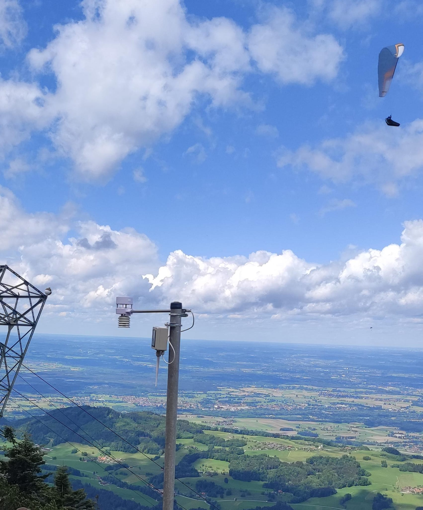

# BreezeDude Wind Sensor
### An open source low power FANET wind data transmitter.

Map of almost all wind stations: [breezedude.de](https://breezedude.de/)

### [Setup Guide & Tools](https://install.breezedude.de/)

For more info and documentation see the [Wiki](https://github.com/Breezedude/breezedudeWindSensor/wiki) and also [Discussion](https://github.com/Breezedude/breezedudeWindSensor/discussions)

----

  <
  
    
   

A low cost FANET wind station using Ecowitt WS80/WS85 ultrasonic or DAVIS 6410 analog sensor.     
USB MSC Settings file and Drag&Drop Firmware upgrade. 

- Wind sensor: Ecowitt WS80/WS85 or analog with reed/potentiometer (e.g. DAVIS 6410)
- Barometric pressure sensor: **HP303B**, BMP280, BMP3xx or SPL06-001
- LoRa module: RFM95W (SX1276), G-NiceRF SX1262, **LLCC68**
- Antenna connector: SMA
- Microcontroller: SAMD21
- Connectivity: USB-C, I2C, 2x UART
- Battery: 1S Li-Ion 16340 750mAh (or 1-3x 18650 external)
- Solar: 5V
- PCB Size: 53x22mm

Currently using a 60x60 5V solar panel.     
Avg. power consumption at 40s send interval @3.7V battery: 0.4mA with analog sensor, 0.80mA with WS85, 1.22mA with WS80
 
Based on SMAD21 using [adafruits samd core](https://github.com/adafruit/ArduinoCore-samd) and itsybitsy M0 variant definitions and [bootloader](https://github.com/adafruit/uf2-samdx1).     

#### Related projects and inspiration:
* https://github.com/gereic/GXAirCom
* https://github.com/jgromes/RadioLib
* https://github.com/3s1d/fanet-stm32

If you like this project

